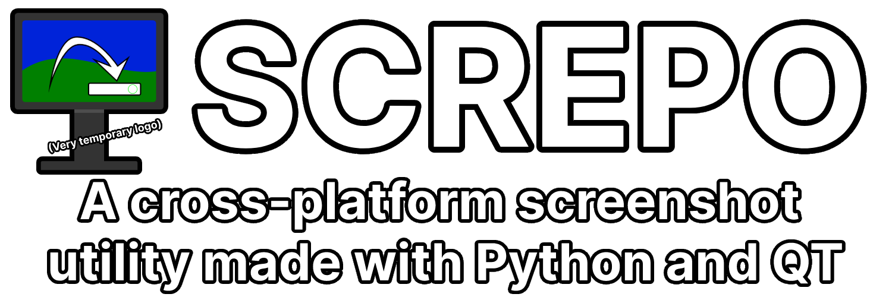
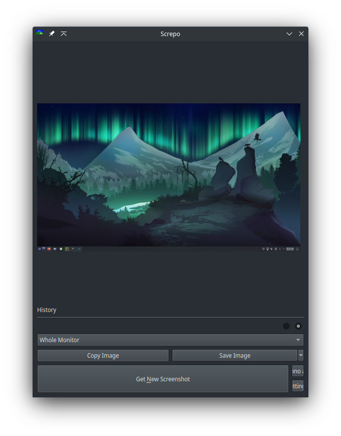
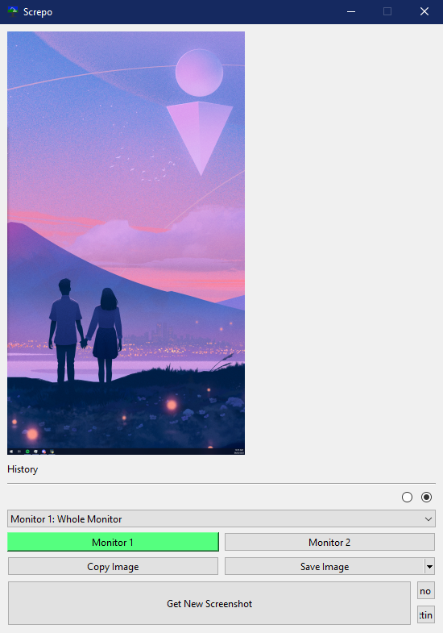

Screpo runs on Windows and Linux desktops running X11 (no Wayland support at the moment unfortunately), and *should* work on Intel-based Macs just fine (maybe Apple-Silicon Macs as well, no clue honestly).
I do not own an Apple device, so I am not able to test them.

Developed with Python 3.9 but should work with any version 3.6+ at minimum

|  |  |
|:-----------------------------------------------------------------------------------------------------------------------------:|:-----------------------------------------------------------------------------------------------------------------:|
|                                  Screpo running on a Linux Desktop<br>(Manjaro + KDE Plasma)                                  |                                        Screpo running on a Windows Desktop                                        |


<!-- Add a Windows screenshot as well -->

### Features
#### History
Saves a configurable number of screenshots in memory for saving later. <br>
<sub>(Currently can eat a lot of RAM depending on how many monitors you have or how many history items you use so be careful with this.)</sub>

#### Webhook Support
Quickly send an image to a Discord channel from the app with the use of a webhook url.

### Build Instructions
1. Clone the repo and change directory to the new folder
2. Create a Python virtual environment
`python -m venv venv`
3. Activate the environment:
```
Windows:
.\venv\Scripts\Activate.ps1

Unix:
source venv/bin/activate
```
4. Install the required libraries
`pip install -r requirements.txt`
5. Run the program with
`python src/Screpo.py`


### To-Do List
- [ ] Add global hotkeys so the program can be triggered from anywhere
- [ ] Allow screenshotting specific areas on the desktop 
- [ ] Improve memory usage
- [ ] Potentially add an editor
- [ ] Implement themes
- [ ] Replace the current temporary logo
- [ ] Detect and grab window locations for screenshotting specific windows
- [ ] Implement snippets - second long recordings that allow you to scrub through the frames for the right moment (if possible, haven't actually looked in the possibility of that)
- [ ] Change to using QT UI files instead of hard-coding everything

### Credits
- Font used in the banner image is [Inter](https://fonts.google.com/specimen/Inter) ([Alternate GitHub Link](https://github.com/rsms/inter/)), licensed under the [Open Fonts License](https://scripts.sil.org/cms/scripts/page.php?site_id=nrsi&id=OFL) 